## Cards

| Name | Image | Upgraded image | Rarity | Type | Cost | Description |
| ---- | ----- | -------------- | ------ | ---- | ---- | ----------- |
| Painkillers |  |  | Basic | Skill | 1 | Heal 75(100) % of HP lost this turn. Exhaust. |
| Defend |  |  | Basic | Skill | 1 | Gain 4(6) Block. |
| Rusty Handgun |  |  | Basic | Attack | 1 | Deal 4 Damage. Crit: !C! % If this Crits, Exhaust. |
| Strike |  |  | Basic | Attack | 1 | Deal 5(7) Damage. |
| Stun Grenade | 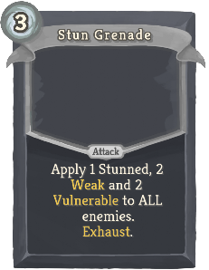 |  | Basic | Attack | 3 | (Innate.)  Deal 3(6) Damage and apply 3(4) Weak and Vulnerable to ALL enemies. Exhaust. |
| Trusty Handgun |  |  | Basic | Attack | 1 | Deal 4(5) Damage. Crit: !C! % |
| Backup Plan |  |  | Common | Skill | 0 | (Retain.)  Choose 1 card from your draw pile and place it into your hand. Exhaust. |
| Bayonet |  |  | Common | Attack | 0 | Expose yourself. Deal 7(9) damage for every Critical hit this turn. Exhaust. (not Exhaust.) |
| Bow | 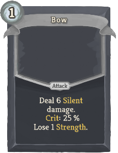 |  | Common | Attack | 1 | Deal 8(10) Silent damage. Crit: !C! % Lose 1 Strength. |
| Burst Fire |  |  | Common | Attack | 2 | Deal 4 Damage 3(4) times. Crit: !C! % Lose 10 Precision for every Critical hit. |
| Calculated |  |  | Common | Skill | 1 | Gain 20(30) Precision. Draw 2 cards. Discard 2 cards. |
| Camouflage |  |  | Common | Skill | 2 | Gain 14(18) Block. |
| Chainsaw |  |  | Common | Attack | 0 | Expose yourself. Deal 6 Damage. Draw a 0-cost card from your draw pile.  (If there are none, shuffle your discard into your draw pile.) |
| Combat Trousers |  | 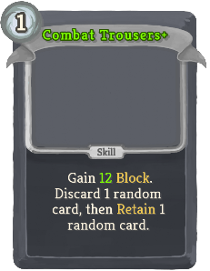 | Common | Skill | 1 | Gain 8(10) Block. Discard 1 random card, then Retain 1 random card. |
| Decoy |  |  | Common | Skill | 1 | Expose yourself. Gain 11(15) Block. |
| Expect Anything |  |  | Common | Skill | 1 | Innate. Ethereal. Gain 10(14) Block. Exhaust. |
| Golden Bullet |  |  | Common | Attack | 2 | Spend 8 Gold. Deal 20(24) damage. Crit: !C! % If this deals Critical hit, Gain 40 Gold. Exhaust. |
| HE Grenade |  |  | Common | Attack | 2 | Deal 10(13) Damage to ALL enemies. |
| Hand Cannon |  |  | Common | Attack | 2 | Deal 9(12) Damage. Target loses 6(8) HP. Lose 25 Precision. |
| Height Advantage |  |  | Common | Skill | 1 | Gain 4(6) Block. Gain 5(10) Precision. Expose ALL enemies. |
| Lay Down |  |  | Common | Skill | 1 | Gain 7(9) Block. Gain 10(20) Precision. Lose 1 Strength for this turn. |
| Molotov Cocktail |  |  | Common | Skill | 1 | Apply 4(6) Burning. |
| Napalm Grenade |  |  | Common | Attack | 2 | Deal 5 Damage and apply 3(5) Burning to ALL enemies. |
| Pump Shotgun |  |  | Common | Attack | 2 | Expose yourself. Deal 2 Damage to random enemy 4(5) times. Crit: !C! % Lose 1 Strength for this turn for every Critical hit. |
| Reposition |  |  | Common | Skill | 1(0) | Draw 2 cards. Lose 1 Strength for this turn. |
| Revolver | 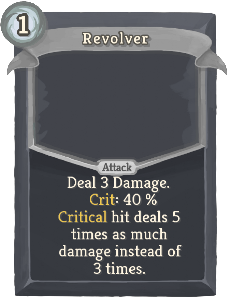 |  | Common | Attack | 1 | Deal 3 Damage. Crit: !C! % Critical hit deals 5(7) times as much damage instead of 3 times. |
| Rocket Jump |  |  | Common | Attack | 1 | Deal 11(12) damage. Shuffle 3 Burns into your discard pile. Draw 4(5) cards. |
| Run And Gun |  |  | Common | Attack | 1 | Deal 5(7) damage, Crit: !C! % Draw 2 cards. |
| Silver Bullet |  |  | Common | Attack | 2 | Lose 3 HP. Deal 20(24) damage. Crit: !C! % If this deals Critical hit, heal 15 HP. Exhaust. |
| UV Laser |  |  | Common | Attack | 1 | Deal 8(10) Silent Damage to ALL enemies. Gain 2 Weak. |
| Acid Bottle |  |  | Uncommon | Skill | 1 | Apply 2(3) Corrosion to an enemy. Exhaust. |
| Aggression |  |  | Uncommon | Power | 1 | Every time you become Vulnerable, remove the effect and ALL creatures (including you) gain 2(3) Strength for this turn. |
| Anti Flame |  |  | Uncommon | Skill | 2 | Gain 17(22) Block. Shuffle 3 Burns into your discard pile. Discard ALL Burns. |
| Assasinate | 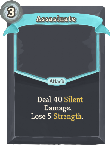 |  | Uncommon | Attack | 3 | Deal 38(46) Silent Damage. Lose 1 Strength 3 times. |
| Concentrate |  |  | Uncommon | Skill | 1 | Gain 1 Concentrated. Draw 3(4) cards. You cannot draw any more cards this turn. |
| Corrosive Grenade |  |  | Uncommon | Attack | 1 | Deal 3(4) Damage and apply 2(3) Corrosion to ALL enemies. Exhaust. |
| Counter Strike |  |  | Uncommon | Power | 1 | Every time you lose Strength or Dexterity, deal 3(4) damage to ALL enemies. |
| Critical Decision |  |  | Uncommon | Skill | 1 | Ethereal. Draw 3(5) cards for every Critical hit you've dealt this turn. |
| Crossbow |  | 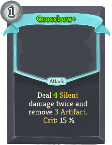 | Uncommon | Attack | 1 | Deal 3(4) Silent damage twice and apply 1(2) Frail twice. Crit: !C! % |
| Defibrilator |  |  | Uncommon | Skill | 0 | (Innate.)  Lose 18(11) HP. Gain 6 Regen. Exhaust. |
| Electric Blood |  |  | Uncommon | Skill | 0 | Gain [R] ([R]). Lose 10 HP. Deal 1 damage to ALL enemies. |
| Electric Grenade | 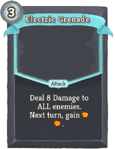 |  | Uncommon | Attack | 3 | Deal 9(12) Damage to ALL enemies. Next turn, gain [R] [R] . |
| Explosives Expert |  |  | Uncommon | Power | 2 | Every time you use a Grenade, draw 2(3) cards. |
| Extended Magazines |  |  | Uncommon | Skill | 1 | Draw 2(3) cards. If you have at most 1 Skill in your hand, Gain [R]. |
| Firepower | 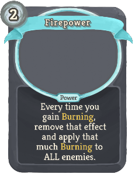 |  | Uncommon | Power | 2(1) | Every time you gain Burning, remove that effect and apply that much Burning to ALL enemies. |
| First Aid Kit |  |  | Uncommon | Skill | 1 | Heal ALL HP lost this turn. Shuffle 2 (Upgraded) Painkillers into your draw pile. |
| Flamethrower |  |  | Uncommon | Attack | X | Apply 3(4) Burning to ALL enemies X times. |
| Flammable Fumes |  |  | Uncommon | Power | 2 | At the end of every turn, increase ALL Burning by 4(6) |
| Flare Gun |  |  | Uncommon | Skill |  | Unplayable. When drawn, Expose yourself, Expose ALL enemies, apply 1 Weak to ALL enemies (, Draw 1 card). |
| Foresight |  |  | Uncommon | Skill | 2 | Gain 11(15) Block. Place a card from your discard pile on top of your draw pile. |
| Frag Grenade |  |  | Uncommon | Attack | 3 | Deal 7(8) Damage to ALL enemies. Deal 2 Silent Damage to a random enemy 7(10) times. |
| Fragile Blood |  |  | Uncommon | Power | 0 | Gain 4(5) Regen. Apply 4(5) Thorns to ALL enemies. |
| Frying Pan |  |  | Uncommon | Attack | 1 | Retain. If you have 0 Block, gain 7(9) Block. Otherwise deal 8(10) damage. |
| Gamma Ray |  |  | Uncommon | Attack | 2 | Deal 5(6) damage twice. Crit: !C! % If this deals 2 critical hits, the second one deals 9 times as much damage. |
| Grenade Launcher |  | 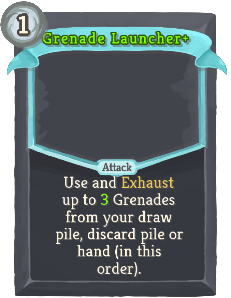 | Uncommon | Attack | 0 | (Retain.)  Use and Exhaust a Grenade from your draw pile, discard pile or hand. |
| Guilt |  |  | Uncommon | Power | 2 | (Innate.)  At the start of every turn, gain [R] [R] ([R]). Every time you play an Attack, lose 2 Strength for one turn. |
| Hand Claws |  |  | Uncommon | Skill | 2 | Lose 6 HP. Add 5(7) Shivs to your hand. (Amount of Shivs affected by damage modifiers.) |
| Heavy Shotgun |  |  | Uncommon | Attack | 3 | Expose yourself. Deal 4(5) Damage to random enemy 4 times. Crit: !C! % Discard a random card for every Critical hit. |
| Hideout |  |  | Uncommon | Skill | 0 | Gain 7(10) Block for every Critical hit you've dealt this turn. Next turn draw 1 card less. |
| Ignite |  | 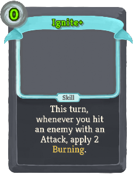 | Uncommon | Skill | 1(0) | This turn, whenever you deal unblocked Attack damage, apply 2 Burning. |
| Insulation |  |  | Uncommon | Skill | 2 | Retain. Exhaust ALL Burns in your (draw and) discard pile. For each, apply 3(4) Burning to ALL enemies. |
| Kevlar |  |  | Uncommon | Skill | 2 | Gain 6(7) Block. If you have less than 6(7) Plated Armor, gain 3(4) Plated Armor. |
| Lock On |  |  | Uncommon | Skill | 1(0) | Expose an enemy. Every other enemy gains 99 Block. Gain 1 Concentrated. Exhaust. |
| Nuclear Power |  |  | Uncommon | Skill | X | Next turn, gain 2 X - 3(2) Energy. |
| Railgun |  |  | Uncommon | Attack | X | Deal 3 Damage X times. Crit: X times !C! %. |
| Save Up |  | 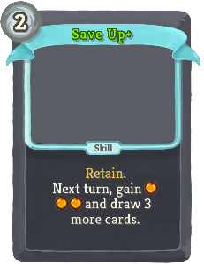 | Uncommon | Skill | 2 | (Retain.)  Next turn, gain [R] [R] and draw 3 more cards. |
| Saw Blade |  |  | Uncommon | Attack | 0 | Expose yourself. Deal 4 Damage to ALL enemies. Draw (1 card. Draw) a 0-cost card from your draw pile. |
| Silver Blood |  |  | Uncommon | Power | 2 | ALL enemies gain 2(1) Strength. Every time you lose HP, gain 1 Regen. |
| Skin = Skill | 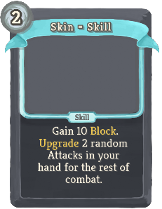 |  | Uncommon | Skill | 2 | Gain 13(17) Block. Upgrade 2 random (ALL) Attacks in your hand for the rest of combat. |
| Smoke Grenade |  |  | Uncommon | Skill | 1(0) | Apply 2 Weak to ALL enemies. Lose 20 Precision. |
| Sniper Rifle |  |  | Uncommon | Attack | 3 | Deal 22(24) damage. Crit: !C! % If this deals Critical hit, copy this card into your draw pile. Exhaust. |
| Steel Blood |  |  | Uncommon | Skill | 1 | Lose 6 HP. Gain 3(5) Metalicize. |
| Tactical Shotgun |  |  | Uncommon | Attack | 2 | Expose yourself. Deal 2 Damage to random enemy 6 times. Crit: !C! % Draw a card for every Critical hit. |
| The Law | 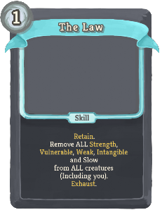 |  | Uncommon | Skill | 1 | (Innate.)  Retain. Remove ALL Strength, Vulnerable, Weak, Intangible and Slow from ALL creatures (Including you). Exhaust. |
| Tracers |  |  | Uncommon | Power | 2 | Every time you play an Attack, gain 5(8) Precision. |
| Ammo Box |  |  | Rare | Skill | 0 | Draw 3(4) cards. This card costs 1 more energy for this turn. Infinitely upgradeable. |
| Automatic Mode |  |  | Rare | Skill | 0 | Gain [R] [R]. Put 3(2) Burns into your discard pile. Can be only played as a first card this turn. |
| Battery Acid |  |  | Rare | Skill | 0 | Gain [R] [R] [R] ([R]). Gain 1 Corrosion. Exhaust. |
| Black Powder |  |  | Rare | Power | 2(1) | Every time a card is exhausted, shuffle HE Grenade into your draw pile. |
| Blast Shields |  |  | Rare | Power | 3 | Every time you use a Grenade, gain 6(8) Block. |
| Cluster Grenade |  |  | Rare | Attack | X | Deal 4(6) Damage to ALL enemies X+1 times. If X is more than 0, gain [R] . |
| Eye For An Eye |  |  | Rare | Power | 3 | Every time you lose HP, deal that (2 times as) much damage to a random enemy. |
| Firewall |  |  | Rare | Skill | 2 | Gain 12(10) Burning. Next turn, Gain 30(40) Block. |
| Friendly Fire |  |  | Rare | Power | 3(2) | For every Burning damage you deal, gain that much Block. |
| Gasoline |  |  | Rare | Skill | 2 | Triple (Quadruple) ALL Burning. Exhaust. |
| Ghost Form |  |  | Rare | Power | 1(0) | Gain 2 Intangible. ALL cards become Ethereal. |
| Lucky Mode |  |  | Rare | Skill | 0 | Gain 1 Weak. Gain 35(50) Precision. Can be only played as a first card this turn. |
| Minigun |  |  | Rare | Attack | 3 | Deal 1 Silent Damage to random enemy 11(15) times. Crit: !C! % Ignores Precision. Fires once more for every Critical hit. Infinitely upgradeable. |
| Perfect Form |  |  | Rare | Power | 4 | Ethereal. Whenever you deal a Critical hit, play the card again. Works 2(3) times per turn. |
| Rocket Launcher |  |  | Rare | Attack | 4 | Deal 30(36) damage. Crit: !C! % Apply 3(4) Burning to ALL enemies. |
| Stealth Mode |  |  | Rare | Skill | 0 | (Innate.)  Gain 1 Intangible. Lose 1 Strength. Can be only played as a first card this turn. |
| Veteran | 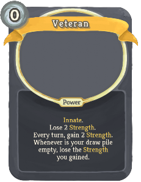 |  | Rare | Power | 0 | Innate. Lose 2(1) Strength. Every turn, gain 2 Strength. Whenever is your draw pile empty, lose the Strength you gained. |
| Void Grenade |  |  | Rare | Attack | 4 | Deal 5(8) Damage to ALL enemies. Play ALL Grenades from your draw (and discard) pile(s). Lose 5 HP. |

## Potions

| Image | Name | Rarity | Description |
| ----- | ---- | ------ | ----------- |

## Relics

| Image | Name | Rarity | Color | Description | Flavor |
| ----- | ---- | ------ | ----- | ----------- | ------ |
|  | Rusty Magazine | Starter | Black | The first time you eneter a combat, #yUpgrade ALL #yRusty #yHandguns in your deck. | Rusty magazine for your Rusty Handgun. |
|  | Rum Bottle | Common | Black | At the start of each turn, gain #b1 #yConcentrated and lose #b8 #yPrecision. | Tasty alcoholic beverage. |
|  | Scales Of Injustice | Boss |  | At the start of each turn, gain 1 energy. At the end of each turn, deal #b6 damage to the creature with lowest #yHP. (Including you) | As if world wasn't unfair enough. |
|  | Trusty Magazine | Boss | Black | Replaces #bRusty #bMagazine. #yTransform ALL #yRusty #yHandguns to #gTrusty #gHandguns. | Trusty magazine for your Trusty Handgun. |

| Image | Name |
| ----- | ---- |
|  | The Marksman |

