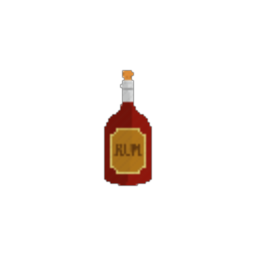

| Image | Name | Rarity | Color | Description | Flavor |
| ----- | ---- | ------ | ----- | ----------- | ------ |
|  | Rusty Magazine | Starter | Black | The first time you eneter a combat, #yUpgrade ALL #yRusty #yHandguns in your deck. | Rusty magazine for your Rusty Handgun. |
|  | Infinite Lighter | Uncommon |  | Whenever you apply #yBurning, apply an additional #b1 #yBurning. | It's flame can't be put out. |
|  | Rusty Helmet | Uncommon | Black | Whenever you land a #yCritical #yHit, gain #b3 #yBlock. | It brings back memories, but how did it get here? |
|  | Hellfire Lighter | Rare | Red | Whenever you apply #yVulnerable or gain #yStrength, apply #b1 #yBurning to ALL enemies. | It's flame grows with your strength. |
|  | Lighter Orb | Rare | Blue | Whenever you #yEvoke an #bOrb, apply #b1 #yBurning to ALL enemies. | It's not that dark nor heavy. |
|  | Poison Lighter | Rare | Green | Whenever you apply #yPoison, apply #b1 #yBurning to ALL enemies. | Who would have thought Poison is flammable. |
|  | Rum Bottle | Rare | Black | At the start of each turn, gain #b1 #yConcentrated and lose #b8 #yPrecision. | Tasty alcoholic beverage. |
|  | Scales Of Injustice | Boss |  | At the start of each turn, gain 1 energy. At the end of each turn, deal #b6 damage to the creature with lowest #yHP. (Including you) | As if world wasn't unfair enough. |
|  | Trusty Magazine | Boss | Black | Replaces #bRusty #bMagazine. #yTransform ALL #yRusty #yHandguns to #gTrusty #gHandguns. | Trusty magazine for your Trusty Handgun. |
